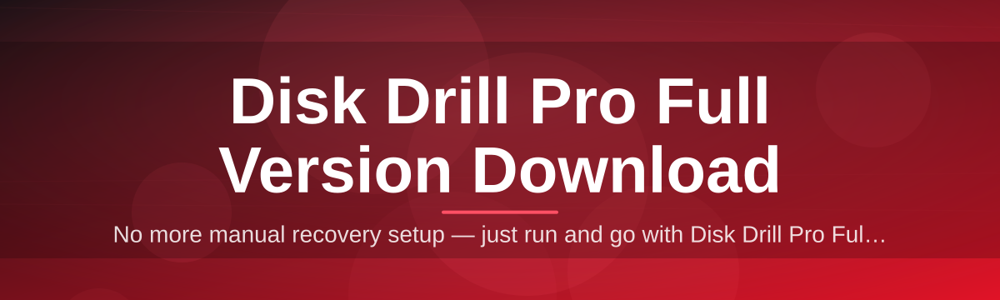
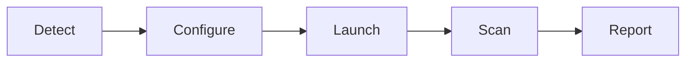

# disk-drill-pro-manager 💽⚡

  

*A no-fuss manager that gets Disk Drill Pro onto your Windows box and keeps it running like it should.*

  

## 🧩 Overview

Lost files don't wait for a convenient time to disappear, and most recovery tools bury the one button you actually need under three menus of upsell noise. **disk-drill-pro-manager** exists to strip that friction away — it's a lightweight wrapper and update manager built around Disk Drill Pro, designed for the moment when a drive fails, a partition vanishes, or a client calls asking "can you get my photos back?"

This project was built solo, shipped fast, and iterated on based on real recovery scenarios — not theoretical ones. It handles the boring parts (version tracking, launch configuration, session logs) so you can focus on the scan. Whether you're a technician running recoveries daily or a home user who just needs to grab a Disk Drill Pro full version download once and move on with your life, this repo is the shortest path there.

It's not a fork of Disk Drill itself — it's the missing control layer around it: a manager that tracks what version you're running, verifies your setup is healthy before a scan, and keeps your recovery sessions organized so nothing gets overwritten twice.

> [!NOTE]
> This is a management/launcher layer. The actual Disk Drill Pro application is distributed through the landing page linked below — this repo just makes the experience around it saner.

---

## 🚀 What It Actually Does

1. **Version-locked launching** — pins the manager to a known-good Disk Drill Pro build so a background update never interrupts a scan mid-recovery.

2. **Smart session tracking** — every scan gets a timestamped session folder, so re-running a recovery never clobbers your last results.

3. **Drive health snapshot** — before you commit to a full deep scan, the manager pulls a quick SMART-style summary so you know if you're racing a dying drive.

4. **Recovery profile presets** — save scan configurations (quick scan, deep scan, partition recovery) as reusable profiles instead of reconfiguring every time.

5. **Log-first troubleshooting** — every action writes a plain-text log, so when something goes sideways you're debugging facts, not guesses.

6. **Zero-bloat footprint** — the manager itself is a thin native layer; it doesn't spin up background services or phone home on a schedule.

7. **One-click landing page sync** — checks whether your local setup matches the latest Disk Drill Pro full version download available on the landing page.

8. **Theme-aware UI** — respects your Windows light/dark preference instead of fighting it.

> [!TIP]
> Run the drive health snapshot *before* your first deep scan. It takes seconds and can save you from scanning a drive that's actively degrading.

---

## 🏁 Getting Started

1. **Visit the landing page** using the download button above — that's the only source this project links to.

2. **Download the installer package** and save it somewhere you'll remember (Downloads is fine, nobody's judging).

3. **Run the setup executable** and follow the on-screen prompts — no command line, no dependency chasing.

4. **Launch the manager** from the Start Menu shortcut it creates, and you're scanning within a minute.

That's the whole flow. No terminal windows, no manual PATH edits, no dependency spiral.

---

## 🖥️ System Requirements

| Component | Minimum | Recommended |
|---|---|---|
| OS | Windows 10 (64-bit) | Windows 11 |
| RAM | 4 GB | 8 GB+ |
| Free Disk Space | 500 MB | 2 GB+ (for recovery staging) |
| Dependencies | None | None |
| Admin Rights | Required for raw disk access | Required |

> [!IMPORTANT]
> This is a standalone Windows tool. It does not require .NET runtimes, Python, or any package manager to be pre-installed — everything it needs ships in the download.

---

## ⚙️ How It Works

The manager sits between you and Disk Drill Pro's engine, coordinating four straightforward stages:

1. **Detect** — checks installed version against the landing page's current release.

2. **Configure** — applies your chosen scan profile and target drive.

3. **Launch** — hands off to the Disk Drill Pro engine with the right flags set.

4. **Report** — collects results and session logs into a dated folder for review.

<strong>Why a separate manager layer instead of running Disk Drill Pro directly?</strong>

Because recovery work is rarely a one-shot task. You scan, you review, you rescan a different partition, you compare results across sessions — and doing that manually means juggling folders and settings by hand. The manager automates that bookkeeping so you can stay focused on the actual recovery decision.

---

## 🩹 Troubleshooting

**Q: The manager says my version is out of date but I just installed it — what gives?**
A: The landing page occasionally rolls out builds in waves. Re-check the download button after a few minutes, or re-download to force the latest package.

**Q: My deep scan seems stuck at the same percentage for a long time.**
A: Large or heavily fragmented drives can sit on a single pass for a while — this is normal for deep scans, not a freeze. Check the session log for active read activity before assuming it's hung.

**Q: I don't see my external drive in the drive list.**
A: Confirm the drive is mounted and visible in Windows Disk Management first. If it shows there but not in the manager, try reconnecting the USB port or refreshing the drive list from the toolbar.

**Q: Can I run two recovery sessions at once?**
A: Technically yes on separate drives, but it's not recommended — simultaneous deep scans compete for I/O and slow both down significantly.

**Q: My scan results folder is empty after a completed scan.**
A: Check that the destination drive had enough free space at the time of recovery. Disk Drill Pro will not overwrite the source drive, so a full destination silently blocks output.

**Q: Does closing the manager cancel an active scan?**
A: No — active scans run in the Disk Drill Pro engine process, not the manager UI, so closing the manager window won't interrupt recovery in progress.

---

## 🎨 UI & UX Details

<strong>Keyboard shortcuts</strong>

| Shortcut | Action |
|---|---|
| `Ctrl + N` | Start new scan profile |
| `Ctrl + R` | Repeat last scan |
| `Ctrl + L` | Open session log |
| `Ctrl + ,` | Open settings |
| `F5` | Refresh drive list |

- **Themes:** Light, Dark, and System-follow — toggle in Settings → Appearance.

- **Notifications:** Optional toast alert when a long scan finishes, so you can walk away from the machine.

- **Compact mode:** Collapses the sidebar for smaller screens or side-by-side monitoring with other tools.

> [!TIP]
> Pin a scan profile to the top bar via right-click → *Pin Profile* if you run the same recovery type often.

---

## 🤝 Contributing & Community

This started as a solo project, but it grows faster with more hands on it.

1. Found a bug? Open an issue with your Windows version and a session log excerpt.

2. Have a feature idea? Discussions are open — no idea is too small to pitch.

3. Want to contribute code? Fork, branch, and submit a pull request against `main`.

> [!WARNING]
> Please don't attach full unredacted session logs to public issues if they contain personal file paths or filenames — trim them first.

  

---

## 📜 License

Released under the [MIT License](LICENSE), 2026. Use it, fork it, build on it.

---

## ⚠️ Disclaimer

This repository provides a management and launcher layer around Disk Drill Pro. It is not an official Disk Drill or CleverFiles product. Always download from the landing page linked in this README, verify the source before running any installer, and back up important data regularly — no recovery tool guarantees 100% retrieval in every scenario.

